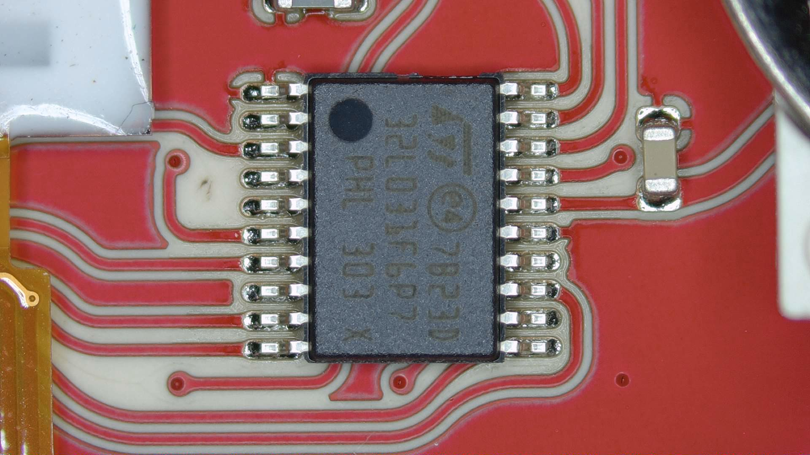
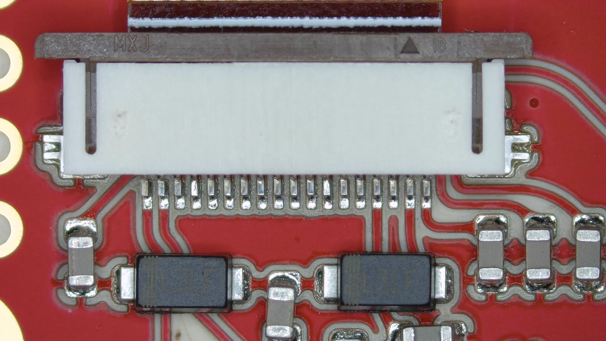
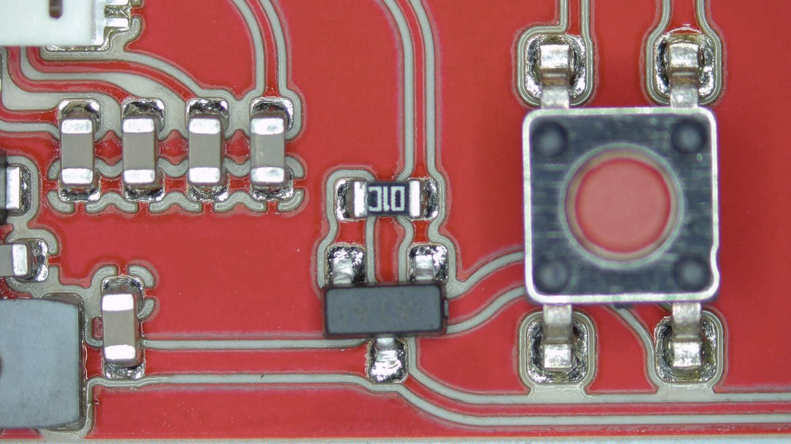
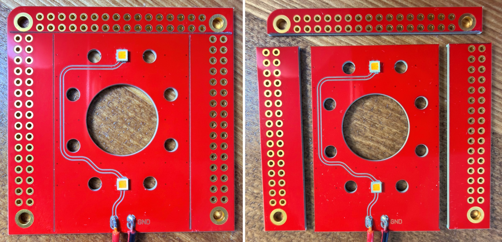

[FirstPrint2021_Combined.jpg](https://pewcb.github.io/EEVblogForum/FirstPrint2021_Combined.jpg)![alt text]

[PewCB_ClimateSensor_CloseUp_Components_01.jpg](https://pewcb.github.io/EEVblogForum/PewCB_ClimateSensor_CloseUp_Components_01.jpg)

[PewCB_ClimateSensor_CloseUp_Components_02.jpg](https://pewcb.github.io/EEVblogForum/PewCB_ClimateSensor_CloseUp_Components_02.jpg)

[PewCB_ClimateSensor_CloseUp_Components_03.jpg](https://pewcb.github.io/EEVblogForum/PewCB_ClimateSensor_CloseUp_Components_03.jpg)

## Cutting through ceramic!

[PewCB_CuttingThroughCeramic_00](https://pewcb.github.io/EEVblogForum/PewCB_CuttingThroughCeramic_00.jpg)