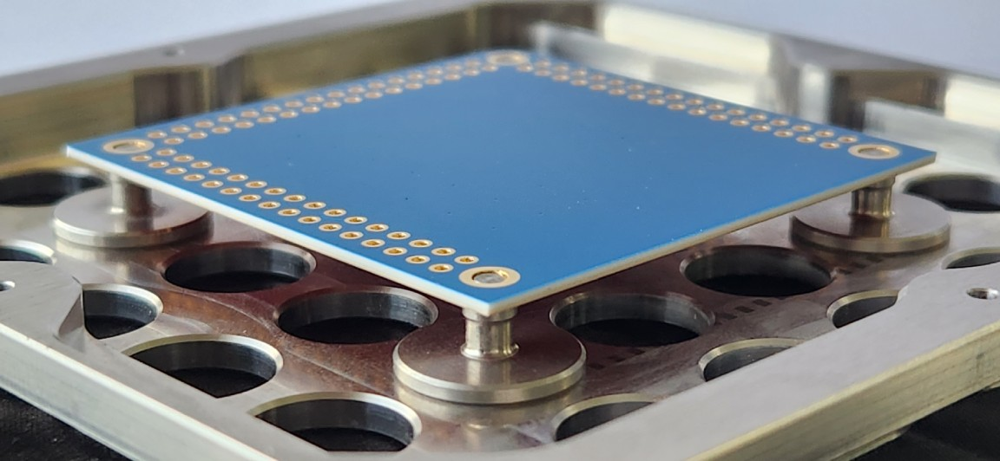
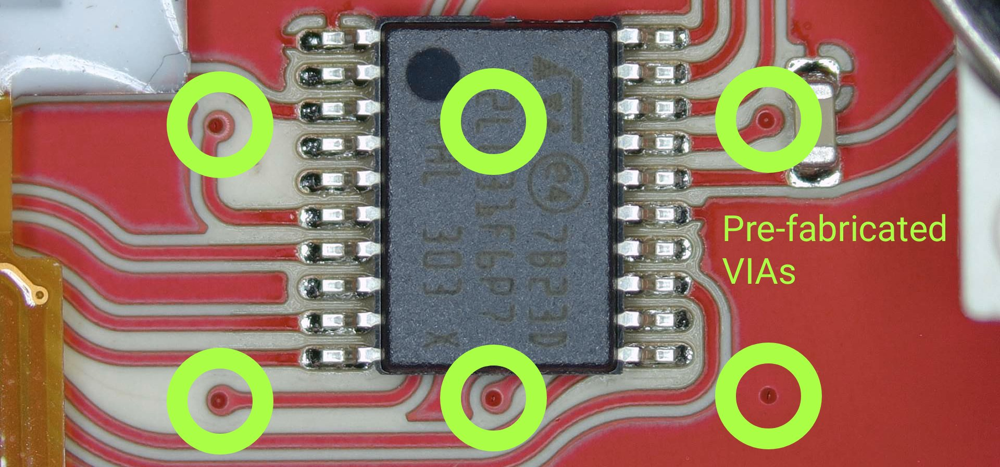
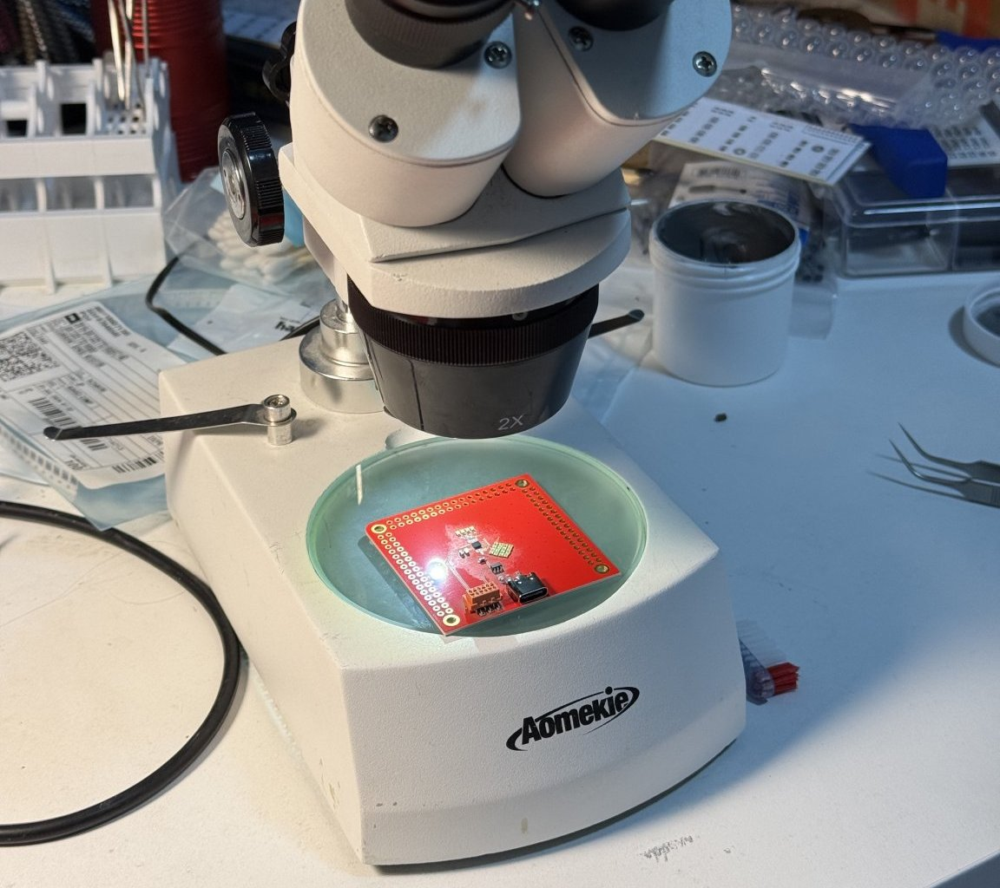
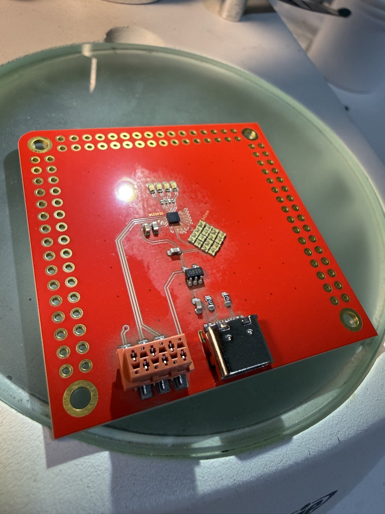
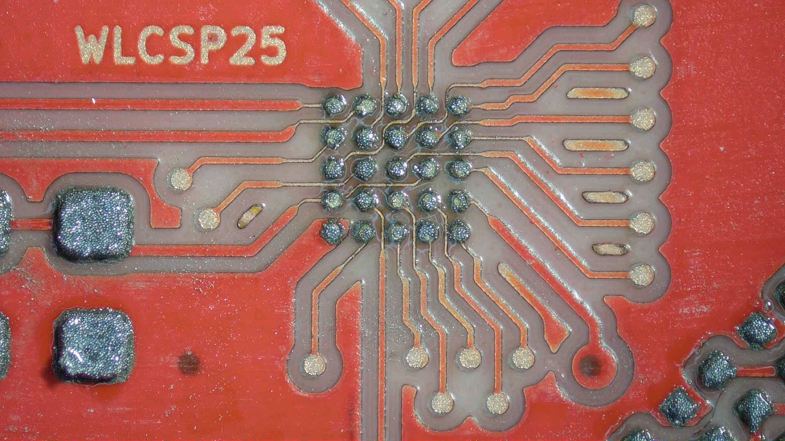
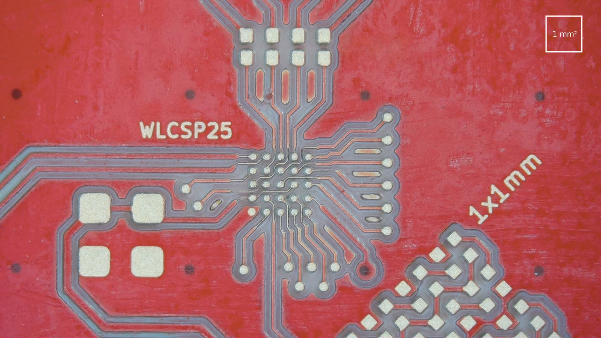
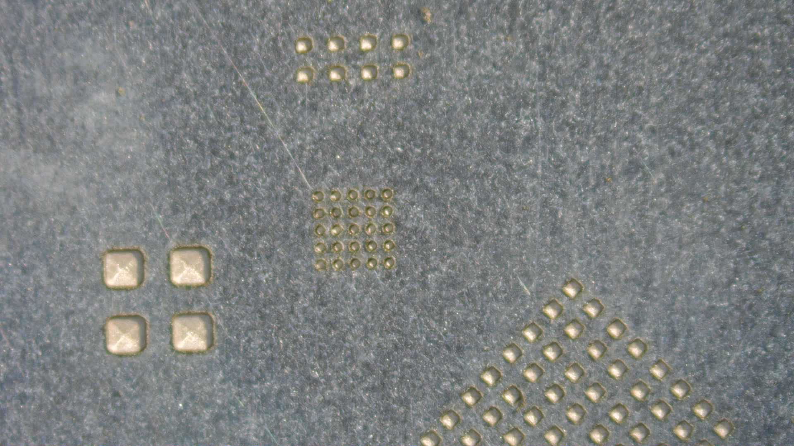

[FirstPrint2021_Combined.jpg](https://pewcb.github.io/EEVblogForum/FirstPrint2021_Combined.jpg)![alt text]

[PewCB_ClimateSensor_CloseUp_Components_01.jpg](https://pewcb.github.io/EEVblogForum/PewCB_ClimateSensor_CloseUp_Components_01.jpg)

[PewCB_ClimateSensor_CloseUp_Components_02.jpg](https://pewcb.github.io/EEVblogForum/PewCB_ClimateSensor_CloseUp_Components_02.jpg)

[PewCB_ClimateSensor_CloseUp_Components_03.jpg](https://pewcb.github.io/EEVblogForum/PewCB_ClimateSensor_CloseUp_Components_03.jpg)

## Cutting through ceramic!

[PewCB_CuttingThroughCeramic_00](https://pewcb.github.io/EEVblogForum/PewCB_CuttingThroughCeramic_00.jpg)

[PewCB_MountingPins.jpg](https://pewcb.github.io/EEVblogForum/PewCB_MountingPins.jpg)

[PewCB_PreFabricatedVias.jpg](https://pewcb.github.io/EEVblogForum/PewCB_PreFabricatedVias.jpg)

## TinyParts

[PewCB_TinyParts_Assembled_01.jpg](https://pewcb.github.io/EEVblogForum/PewCB_TinyParts_Assembled_01.jpg)

[PewCB_TinyParts_Assembled_02.jpg](https://pewcb.github.io/EEVblogForum/PewCB_TinyParts_Assembled_02.jpg)

[PewCB_TinyParts_Paste.jpg](https://pewcb.github.io/EEVblogForum/PewCB_TinyParts_Paste.jpg)

[PewCB_TinyParts_PCB.jpg](https://pewcb.github.io/EEVblogForum/PewCB_TinyParts_PCB.jpg)

[PewCB_TinyParts_Stencil.jpg](https://pewcb.github.io/EEVblogForum/PewCB_TinyParts_Stencil.jpg)

